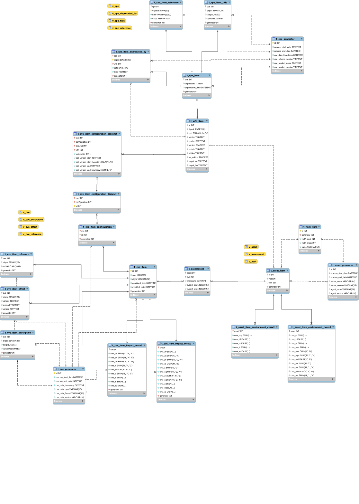

# canvas_data database
## Description
The CANVAS Data database hold all required informations in order to perform vulnerability assessment. This database contains a list of known CVE and CPE. It also contains a list of assets found in the information system and a list of assessment results.

### Related standards
#### CVSS: Common Vulnerability Scoring System SIG
 - [Common Vulnerability Scoring System v3.0: Specification Document](https://www.first.org/cvss/specification-document)
 - [A Complete Guide to the Common Vulnerability Scoring System (CVSSv2)](https://www.first.org/cvss/v2/guide)

#### CVE: Common Vulnerabilities and Exposures
 - [CVE Documents](https://cve.mitre.org/about/documents.html)
 - [CVE Compatibility Guidelines](https://cve.mitre.org/compatible/guidelines.html)

#### CWE: Common Weakness Enumeration
 - [CWE Documents](https://cwe.mitre.org/about/documents.html)

#### WFN: Well Formatted CPE Names
 - [Common Platform Enumeration: Dictionary Specification Version 2.3](https://csrc.nist.gov/publications/detail/nistir/7697/final)
 - [Common Platform Enumeration: Name Matching Specification Version 2.3](https://csrc.nist.gov/publications/detail/nistir/7696/final)
 - [Common Platform Enumeration: Naming Specification Version 2.3](https://csrc.nist.gov/publications/detail/nistir/7695/final)
 - [Common Platform Enumeration: Applicability Language Specification Version2.3](https://csrc.nist.gov/publications/detail/nistir/7698/final)

## Database Objects
### Summary

### Users
User name | Description
--------- | -----------
u_canvas_product_inventory | Product inventory subsystem user. Can Read/Write/Execute on all CPE and WFN related tables. Can Read all tables.
u_canvas_vulnerability_inventory | Vulnerability inventory subsystem user. Can Read/Write/Execute on all CVE and WFN related tables. Can Read all tables.
u_canvas_asset_inventory | Asset inventory subsystem user. Can Read/Write/Execute on all Asset and WFN related tables. Can Read all tables.
u_canvas_dashboard | Dashboard subsystem user. Can Read all tables.

### Tables
#### WFN related
Table name | Description
---------- | -----------
t_wfn_item | List of all different known WFN entries

#### CPE related
Table name | Description
---------- | -----------
t_cpe_generator | Lists of tools used to fill CPE list
t_cpe_item | List all known CPE
t_cpe_item_title | Contains title strings of a CPE
t_cpe_item_reference | Contains reference links of a CPE

#### CVE related
Table name | Description
---------- | -----------
t_cve_generator | Lists of tools used to fill CVE list
t_cve_item | List all known CVE
t_cve_item_description | Contains description strings of a CVE
t_cve_item_reference | Contains reference links of a CVE
t_cve_item_reference | Contains affected products of a CVE
t_cve_item_impact_cvssv2 | Contains CVSSv2 base and temporal metrics of a CVE
t_cve_item_impact_cvssv3 | Contains CVSSv3 base and temporal metrics of a CVE
t_cve_item_configuration | List all configurations for a CVE
t_cve_item_configuration_conjunct | Contains all "AND" nodes of a configuration DNF eq.
t_cve_item_configuration_disjunct | Contains all "OR" nodes of a configuration DNF eq.

#### Asset related
Table name | Description
---------- | -----------
t_asset_generator | List of tools used to fill asset or host list
t_host_item | List of known hosts
t_asset_item | List of known assets
t_asset_environment_cvssv2 | Contains CVSSv2 environment metric for an asset
t_asset_environment_cvssv3 | Contains CVSSv3 environment metric for an asset

#### Assessment related
Table name | Description
---------- | -----------
t_assessment | List of assessment results

### Functions
Function name | Description
------------- | -----------
f_compute_digest | Return a BINARY(20) SHA1 digest of data.
f_is_cve_match_host | Return TRUE if the given CVE configuration match the given host configuration.
f_wfn_param_to_sql_like | Transform a WFN parameter in order prepare a SQL LIKE comparison. Return a TINYTEXT string.

### Stored procedures
Procedure name | Description
-------------- | -----------
p_asset_complete_update_process | Update an Asset generator entry and save the update process end date.
p_asset_save_asset | Save a new asset for a host or update existing.
p_asset_save_host | Save a new host or update existing.
p_asset_start_update_process | Create a new Asset generator entry and save its id into "generator_id".
p_cpe_complete_update_process | Update a CPE generator entry and save the update process end date.
p_cpe_save_cpe | Save a CPE item and save corresponding WFN item if needed. CPE item id is saved into "cpe_id".
p_cpe_save_cpe_deprecated_by | Save a CPE item deprecated_by and replace existing if any.
p_cpe_save_cpe_reference | Save a CPE item reference and replace existing if any.
p_cpe_save_cpe_title | Save a CPE item title and replace existing title if any.
p_cpe_start_update_process | Create a new CPE generator entry and save its id into "generator_id".
p_cve_complete_update_process | Update a CVE generator entry and save the update process end date.
p_cve_configuration_add_conjunction | Create a new configuration conjunction entry for given CVE
p_cve_configuration_add_disjunction | Create a new configuration disjunction entry for given CVE
p_cve_configuration_flush | Erase all configuration entry of a given CVE. It delete disjunct and conjunct entries too.
p_cve_configuration_new | Create a new configuration entry for given CVE
p_cve_save_cve | Save a CVE item. CVE item id is saved into "cve_id".
p_cve_save_cve_affect | Save a CVE item affected product and replace existing if any.
p_cve_save_cve_description | Save a CVE item description and replace existing if any.
p_cve_save_cve_impact_cvssv2 | Save or update a CVE item CVSSv2 impact.
p_cve_save_cve_impact_cvssv3 | Save or update a CVE item CVSSv3 impact.
p_cve_save_cve_reference | Save a CVE item reference and replace existing if any.
p_cve_start_update_process | Create a new CVE generator entry and save its id into "generator_id".

### Views
View name | Description
--------- | -----------
v_assessment | List of assessments and associated scores
v_asset | List of assets
v_cpe | List of known CPE
v_cpe_deprecated_by | List of CPE deprecation relations
v_cpe_reference | List of CPE references
v_cpe_title | List of CPE titles
v_cve | List of known CVE and associated CVSS metrics
v_cve_affect | List of affected product for a CVE
v_cve_description | List of CVE descriptions
v_cve_reference | List of CVE references
v_host | List of identified hosts

### Triggers
Trigger name | Description
------------ | -----------
tr_assess_updated_asset | Perform automatic assessment on new or updated identified asset
